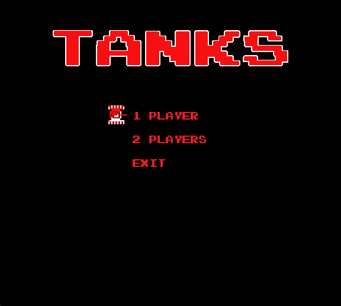
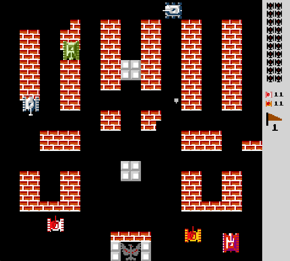
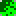

# wartank1990
Tank 1990 được viết bằng C++ sử dụng thư viện SDL 2.0

  
# CÁCH CHƠI:
  ## PLAYER 1 (XE TĂNG MÀU ĐỎ + TRẮNG):
  - `↑`	 : di chuyển lên trên
  - `←` : di chuyển sang trái
  - `↓`	 : di chuyển xuống dưới
  - `→` : di chuyển sang phải
  - `Right Control` : bắn
  ## PLAYER 2 (XE TĂNG MÀU ĐỎ + VÀNG):
  - `W` : di chuyển lên trên
  - `A` : di chuyển sang trái
  - `S` : di chuyển xuống dưới
  - `D` : di chuyển sang phải
  - `F` : bắn
  ## CÁC PHÍM ĐIỀU KHIỂN KHÁC
  - `ESC`: thoát
  - `ENTER`: chọn
  - `N`: chơi màn tiếp theo
  - `B`: chơi màn trước đó
  - `P`: tạm dừng trò chơi
  
---
# LUẬT CHƠI:
  - Những người chơi điều khiển xe tăng tiêu diệt kẻ địch và bảo vệ đại bàng của mình
  - Người chơi tiêu diệt kẻ địch màu hồng sẽ sinh ra các bonus, nhặt các bonus để xe tăng bản thân mạnh hơn
  - Các bonus có trong game:
    +  Xe tăng: tăng 1 mạng cho xe tăng
    +  Đồng hồ: dừng thời gian tất cả kẻ địch
    +  Lựu đạn: tiêu diệt tất cả kẻ địch
    +  Mũ cối: tạo giáp bất tử cho xe tăng
    +  Sao: nhặt càng nhiều sao xe tăng sẽ càng mạnh, tối đa 3 sao
    +  Súng: tương đương với nhặt 3 sao

# BẢN ĐỒ CÁC MÀN CHƠI:
  - Các màn chơi được thiết kế và lưu trong file `level` với đuôi `.txt`
  - Các màn chơi được thiết kế dựa trên mảng 2 chiều với 26 dòng và 26 cột.
  - Các vật thể trên mỗi màn chơi:
    + **.** biểu diễn ô trống, tức có thể đi được.
    + **#**  Tường gạch: người chơi có thể bắn vỡ với 2 viên đạn hoặc với 1 viên nếu tích đủ 3 sao (hoặc ăn bonus Súng).
    + **@**  Tường đá: người chơi chỉ có thể bắn vỡ khi tích đủ 3 sao hoặc ăn được bonus Súng.
    + **%**  Bụi cỏ: người chơi có thể đi xuyên qua và có thể "cắt" khi tích đủ 3 sao hoặc ăn được bonus Súng.

# GAME
## Video Demo
  -[Video](https://youtu.be/E4H3WhQxdic)

## Chi tiết về Game

### Thuật toán sử dụng
  - 4 xe tăng địch được setting với 3 cấu hình khác nhau(tốc độ, số lượng đạn bắn ra).
  - Cả 4 sẽ cùng hướng về con đại bàng của người chơi với `rand()` direction.
  - Các bonus và các loại xe tăng được hồi sinh cũng là random.
  
  -[Link Background Music](https://www.youtube.com/watch?v=hOh67NZM7BM)

  -[File chi tiết](https://resilient-island-47e.notion.site/Wartank-1990-e767abbe331d4e80818b33674a109a27?pvs=4)
  
---
